# CSV Data Pipeline Deployment System

A comprehensive deployment script that visualizes the entire preprocessing pipeline with detailed side branches showing data removal at each step.

## 🚀 Quick Start

```bash
# Install dependencies
pip install -r requirements.txt

# Run the deployment
python deploy_pipeline.py
```

## 📊 Features

### Advanced Pipeline Visualization
- **Side Branches**: Shows exactly how many rows are removed at each step
- **Multiple Diagram Types**: Main pipeline, data flow, and quality issues
- **Interactive Reports**: HTML visualization index
- **Comprehensive Logging**: Detailed JSON and text reports

### Generated Outputs
```
pipeline_output/
├── 📊 Reports
│   ├── pipeline_report.json      # Detailed JSON report
│   ├── pipeline_report.txt       # Human-readable report
│   └── DEPLOYMENT_SUMMARY.txt    # Quick summary
├── 📈 Visualizations
│   ├── plots/                    # Generated charts and graphs
│   ├── periodicity_analysis.png  # Circular periodicity visualization
│   └── visualizations_index.html # Interactive web index
├── 🎨 Mermaid Diagrams
│   └── pipeline_diagram.mmd      # Complete pipeline with side branches
└── 💾 Cleaned Data
    └── cleaned_data.csv          # Clean dataset in CSV format
```

## 🎯 Pipeline Visualization

The deployment creates a comprehensive Mermaid diagram showing the complete preprocessing pipeline:

### Advanced Pipeline Diagram
Shows every preprocessing step with **side branches** for each removal criteria:

```mermaid
graph TD
    A[Load_CSV<br/>📊 Input: 275<br/>📤 Output: 272]
    step1[Clean_Data<br/>📊 Input: 272<br/>📤 Output: 254]
    A --> step1
    removed1[🗑️ Removed: 18<br/>rows]
    step1 -.-> removed1
```


### 2. Data Flow Diagram
Shows the complete data transformation process:
- Input processing
- Format fixes
- Typo corrections
- Type conversions
- Output generation

### 3. Quality Issues Diagram
Categorizes and visualizes all data quality problems found:
- Format issues (double commas, missing decimals)
- Typo issues (l→1, O→0, scientific notation)
- Missing values
- Duplicates

## 📈 What Gets Tracked

| Step | Input Rows | Output Rows | Removed | Reason |
|------|------------|-------------|---------|---------|
| **Load CSV** | 305 | 275 | 30 | Comment lines |
| **Clean Data** | 275 | 272 | 3 | Format fixes, typos |
| **Validate** | 272 | 272 | 0 | Quality checks |

## 🔧 Configuration

Edit `deploy_pipeline.py` to customize:

```python
# Configuration
CSV_FILE = "geyser.csv"        # Input CSV file
OUTPUT_DIR = "pipeline_output"  # Output directory
SKIP_ROWS = 30                  # Rows to skip (comments)
```

## 📊 Example Output

After running the deployment, you'll see:

```
🚀 DEPLOYING CSV DATA PREPROCESSING PIPELINE
============================================================
📁 Input file: geyser.csv
📁 Output directory: pipeline_output
⏰ Started at: 2024-01-15 14:30:25

🔄 STEP 1: Loading CSV data...
✅ Successfully loaded 272 rows and 2 columns
  ✅ Pipeline reports generated

🔄 STEP 2: Cleaning data...
✅ Data cleaned: 272 rows remaining
  ✅ Pipeline reports generated

🔄 STEP 3: Validating data...
  ✅ Pipeline reports generated

🔄 STEP 4: Generating reports...
  ✅ Pipeline reports generated

🔄 STEP 5: Creating visualizations...
✅ Created 5 visualization files
  ✅ Visualization index created

🔄 STEP 6: Generating Mermaid diagrams...
  ✅ Mermaid diagrams generated

🔄 STEP 7: Exporting data...
  ✅ Exported CSV: cleaned_data.csv
  ✅ Exported PICKLE: cleaned_data.pkl
  ✅ Exported PARQUET: cleaned_data.parquet
  ✅ Exported FEATHER: cleaned_data.feather

🔄 STEP 8: Generating deployment summary...
  ✅ Deployment summary generated

✅ PIPELINE DEPLOYMENT COMPLETE!
📁 All outputs saved to: pipeline_output

🎉 SUCCESS! Pipeline deployed to: pipeline_output
```

## 🎨 Mermaid Diagram Features

The generated diagrams include:

- **Side Branches**: Dotted lines showing removed data at each step
- **Color Coding**: Different colors for different types of operations
- **Detailed Labels**: Input/output row counts and removal reasons
- **Professional Styling**: Clean, readable diagram format

## 📋 Requirements

- Python 3.7+
- pandas >= 1.5.0
- numpy >= 1.21.0
- matplotlib >= 3.5.0
- seaborn >= 0.11.0
- pyarrow >= 10.0.0 (for Parquet support)
- fastparquet >= 0.8.0
- tables >= 3.7.0 (for HDF5 support)

## 🔍 Troubleshooting

### Common Issues

1. **Missing dependencies**: Run `pip install -r requirements.txt`
2. **CSV file not found**: Ensure `geyser.csv` is in the current directory
3. **Visualization errors**: Install matplotlib and seaborn
4. **Memory issues**: The script handles large files efficiently

### Output Files

- Check `pipeline_report.txt` for detailed analysis
- Open `visualizations_index.html` in a browser
- Use the `.mmd` files in Mermaid-compatible tools
- Import cleaned data using your preferred format

## 📞 Support

For questions or issues:
1. Check the `pipeline_report.json` for detailed logs
2. Review the `DEPLOYMENT_SUMMARY.txt` for quick overview
3. Examine the generated visualizations for data insights

## 🎯 Next Steps

After deployment:
1. **Review Reports**: Check the generated analysis files
2. **Visualize Data**: Open the HTML visualization index
3. **Use Clean Data**: Import the cleaned dataset in your preferred format
4. **Document Process**: Use the Mermaid diagrams in your documentation
5. **Iterate**: Modify the pipeline configuration as needed
